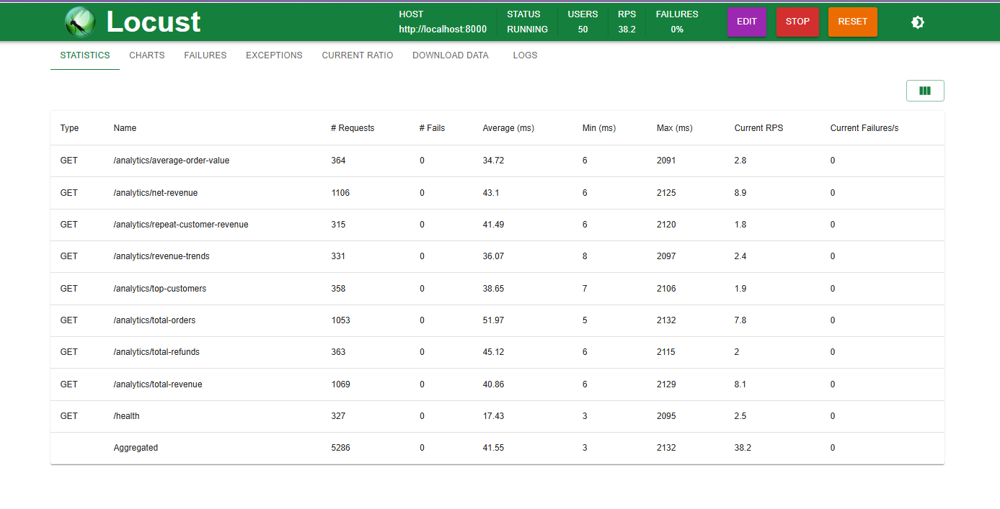
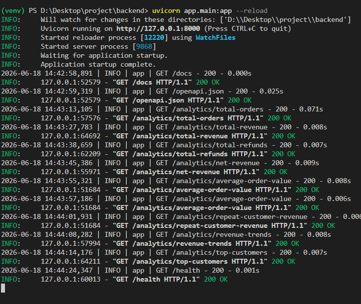

# Analytics Backend Service

## Overview

This project is a FastAPI-based analytics backend that processes customer, order, and refund data. The system provides APIs for data ingestion and business analytics such as total revenue, refunds, net revenue, revenue trends, and top customers.

The project was designed to handle large datasets efficiently while keeping analytics response times low.

## Features

* Customer, Order, and Refund management
* Data ingestion pipeline
* Revenue and refund analytics
* Top customer analysis
* Monthly revenue trends
* MySQL database integration
* Database migrations using Alembic
* Automated testing with Pytest
* Load testing using Locust

## Tech Stack

* FastAPI
* Python
* MySQL
* SQLAlchemy
* Alembic
* Pytest
* Locust

## Project Structure

```text
app/
├── api/
├── models/
├── services/
├── repositories/
├── database/
└── main.py
```

The project follows a layered architecture:

* API Layer – Handles HTTP requests
* Service Layer – Contains business logic
* Repository Layer – Handles database operations
* Database Layer – Stores application data

## Database

The application uses MySQL with the following core tables:

* customers
* orders
* refunds

Relationships:

* One customer can have multiple orders
* One order can have multiple refunds

## Main APIs

### Data APIs

* GET /customers
* GET /orders
* GET /refunds

### Analytics APIs

* GET /analytics/total-orders
* GET /analytics/total-revenue
* GET /analytics/total-refunds
* GET /analytics/net-revenue
* GET /analytics/revenue-trends
* GET /analytics/top-customers

### Ingestion API

* POST /ingest

## Setup

1. Create a virtual environment
2. Install dependencies

```bash
pip install -r requirements.txt
```

3. Configure the database connection in `.env`

4. Run migrations

```bash
alembic upgrade head
```

5. Start the application

```bash
uvicorn app.main:app --reload
```

## Testing

Run tests using:

```bash
pytest
```

## Load Testing

Run Locust:

```bash
locust -f load_test/locustfile.py
```
locust -f load_test/locustfile.py --host=http://localhost:8000


## Future Improvements

* Real-time analytics
* Dashboard integration
* Caching with Redis
* Background processing with Celery

## Author

Developed as a backend analytics system for large-scale data processing and reporting.


## Load Test Results

- Concurrent Users: 50
- Total Requests Processed: 5,286
- Average Response Time: 41.55 ms
- Requests Per Second (RPS): 38.2
- Failure Rate: 0%
- All analytics endpoints responded well below the required 2-second threshold.



## Application Logs

- FastAPI application started successfully.
- Analytics endpoints were accessed successfully.
- All requests returned HTTP 200 OK responses.
- No application errors were observed during testing.
- Successfully met the performance requirement by maintaining analytics API response times below 2 seconds under concurrent load, with 0% failures.


